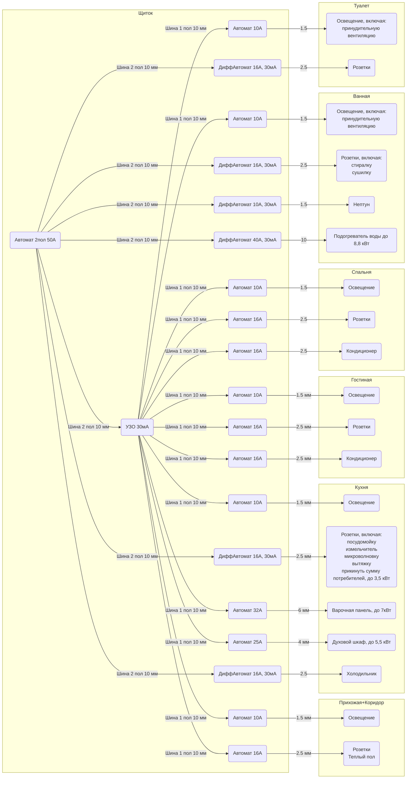

# KraskoElectric

Схема разводки электричества

## Заметки

### Линии защищаемые от тока утечки

Вероятность заземлиться водопроводом или батареей

- розетки в ванной (стиралка, сушилка)
- розетки в кухне (посудомойка, измельчитель)ы
- подогреватель воды
- холодильник
- нептун (ему хватит 1,5мм по мощности, можно съэкономить)

Нептун и холодильник изолированными линиями, чтобы при выбивании общего УЗО их не отрубало

### Вводное УЗО

Так как много линий с дифавтоматами, тогда их не имеет смысла вести через УЗО, и вероятность аккумулирования утечки на 30мА в линиях через УЗО еще ниже, поэтому в качестве противопожарного вводного УЗО можно ставить 30мА, тогда оно еще и человеков защитит.
В случае проблем, будет несложно перекоммутировать щиток. Но все современные приборы качественные, так что вряд ли набежит такой ток утечки.

### Розетки на кухне

Если суммарные потребители сделают перебор, который не уложится в 16А (3,5 кВт), то можно запитать вытяжку от линии освещения, потому что на линии освещения 2,2 кВт, а реальных потребителей (энергосберегающие лампы + дидодные ленты), максимум Ватт на 500, есть запас. Я у себя так и сделал

### Подогреватель

Выглядит странновато херачить линию в 10мм2 если ввод в квартиру скорее всего такой же, но по ПУЭ таблицы говорят именно так. Я лично за то, что лучше перестраховаться с электричеством. Если все грамотно рассчитать, то минимальный срок службы 25 лет, и вероятность пожара близка к 0. А стоимость ремонта в случае, если риски оправдаются будет высокой, из-за того что провода замурованы.

## Схема

- по умолчанию дифавтомат 2 полюса, если не указано иное
- по умолчанию автомат 1 полюс, если не указано иное

